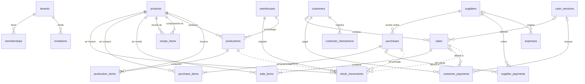

# Diagrama ER del MVP

Mapa visual de la estructura de información. El detalle fino (tipos, checks, invariantes)
vive en `data-model.md` — ante discrepancia, manda data-model.md y se corrige aquí.
Omitido por legibilidad: `tenant_id` (toda tabla lo lleva, FK a tenants), `created_by`
(toda tabla de negocio, FK a auth.users), `created_at`, y las vistas (derivadas).

Notas de lectura:
- `stock_movements` es el Kardex: todo documento que afecta stock (compra recibida, venta
  confirmada/POS, producción) genera ahí sus filas vía RPC — las líneas punteadas son la
  referencia polimórfica `ref_type/ref_id`.
- `sales.customer_id` es nullable (venta de mostrador) igual que `sales.cash_session_id`
  (venta back-office sin caja): por eso `|o--o{`.
- Vistas derivadas (no en el diagrama): current_stock, kardex, supplier_balances,
  customer_balances, customer_history, cash_session_summary, monthly_pnl, monthly_expenses,
  cash_flow, product_profitability.
